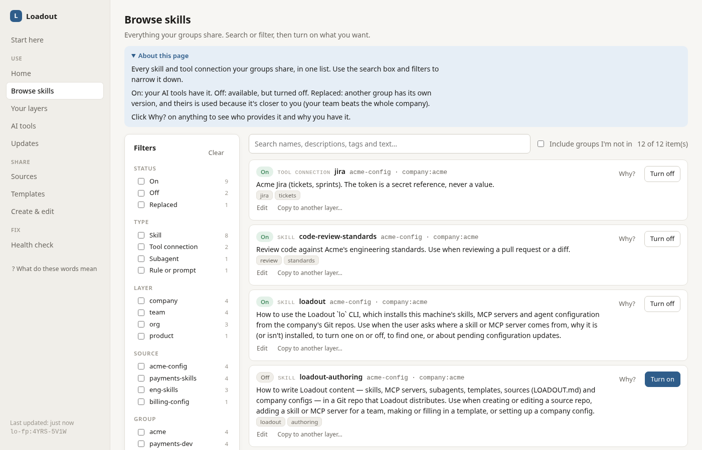
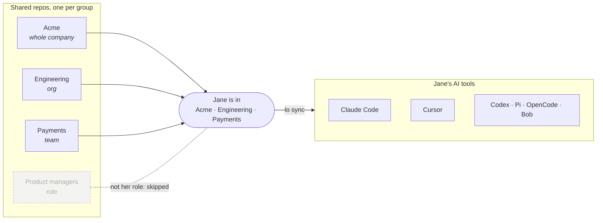
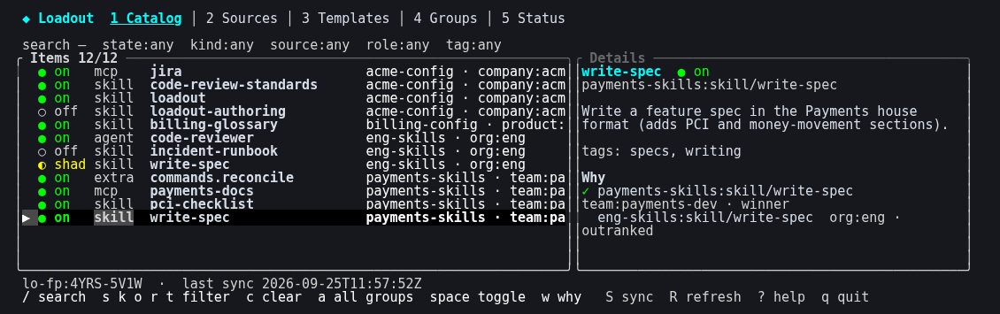
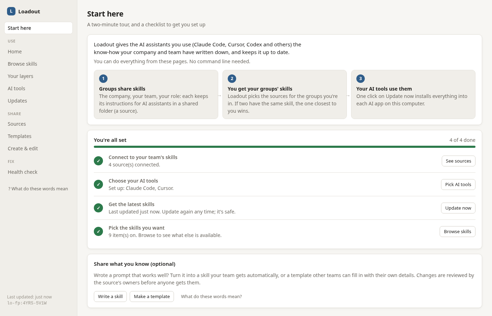
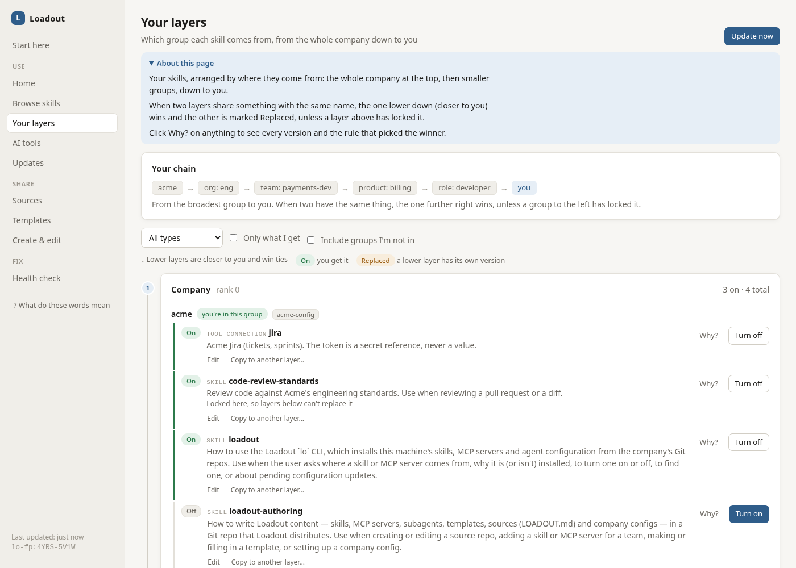

<p align="center">
  <picture>
    <source media="(prefers-color-scheme: dark)" srcset="docs/assets/logo-dark.svg">
    
  </picture>
</p>

# Loadout

**Loadout** (`lo`) distributes AI-agent configuration (skills, MCP
servers, subagents, plugins and rules) across a company from federated Git
repos. Each team, org, product or role owns its own repo. Each person gets
the right combination for who they are, installed into every AI tool they use
(Claude Code, Pi, Codex, Cursor, OpenCode, IBM Bob, or any tool you
describe in a small TOML file) in that tool's own format.

- **One command to set up:** `lo init <company-config-url>` works out which groups
  you belong to (GitHub/GitLab teams, env, your IdP via a script, or opt-in)
  and installs their items.
- **Layered and explainable:** the most specific layer wins unless a more
  general one locks an item. `lo why` shows the reasoning.
- **Safe updates:** every source is pinned by commit in `loadout.lock`. Changes
  are audited and wait for your review unless the company config auto-applies them.
- **No secrets in repos:** MCP configs hold references like
  `secret://jira/token`, resolved from your keychain/1Password/Vault when the
  server starts, and never written to disk.
- **Works with any agent:** a single static binary with no daemon and no
  server. Agent plugins are thin wrappers around the CLI.

<p align="center">
  
</p>

> **New here?** The **[wiki](docs/wiki/Home.md)** explains Loadout step by
> step: [getting started](docs/wiki/Getting-Started.md),
> [how layers work](docs/wiki/How-Layers-Work.md), [the web UI](docs/wiki/Using-the-Web-UI.md),
> [sharing skills](docs/wiki/Sharing-Skills.md) and
> [setting up a company](docs/wiki/Setting-Up-Your-Company.md).

## Install

Linux and macOS (x64; checksum-verified against the release's `SHA256SUMS`):

```sh
curl -fsSL https://raw.githubusercontent.com/Drewdl3/loadout/main/install.sh | sh
# …and go straight into setup:
curl -fsSL https://raw.githubusercontent.com/Drewdl3/loadout/main/install.sh | sh -s -- --company-config https://git.example.com/acme/agent-config
```

Windows (x64, PowerShell):

```powershell
irm https://raw.githubusercontent.com/Drewdl3/loadout/main/install.ps1 | iex
```

Anywhere else (arm64), build from source with Rust 1.96+:

```sh
cargo install --git https://github.com/Drewdl3/loadout loadout-cli
```

Prebuilt static binaries (amd64: Linux musl, macOS, Windows) are attached to
each GitHub Release. Update later with `lo self-update`. You need `git` on
`PATH`; Loadout uses your normal Git credentials.

## Quickstart

**As a developer at a company with a company config:**

```sh
lo init https://git.example.com/acme/agent-config   # discover groups, pick tools, first sync
lo profile                    # which groups you're in, and why
lo list                       # what's installed
lo why skill/write-spec       # which source won, and why
lo join product:billing       # opt into a group
lo tui                        # or browse, filter and toggle in the terminal
lo ui                         # …or in a local web dashboard
```

**Without a company config:** subscribe to sources directly.

```sh
lo subscribe https://git.example.com/acme/payments-skills   # any Git URL or local path
lo sync
```

**As a team publishing skills, or for your own:**

```sh
lo init                        # in a terminal: pick "join", "create a source", "personal source" or "company config"
lo init --new-source payments-skills --layer team --group payments-dev --upstream https://git.example.com/acme/eng-skills
lo init --new-source my-skills --layer user --upstream https://git.example.com/acme/payments-skills --subscribe
lo init --new-company acme-config --company acme --git-init
```

`--new-source` (alias `--catalog`) scaffolds a source repo: a `LOADOUT.md`,
an example skill, an `AGENTS.md` for AI agents, and a CI workflow that audits it. `--git-init` commits the
scaffold, and `--subscribe` also subscribes you to it so you can try it
straight away. A **personal source** (`--layer user`) is your own layer. It
outranks every other layer, so your versions of unlocked items win, and
through `upstream:` it pulls in your team's layers. Add items, push, and
list the repo in the company config (or have people `lo subscribe` to it).

[`examples/`](examples/README.md) has a complete setup for a fictional
company (a company config plus org, team, product and role repos) and a script that
tries it in a throwaway sandbox. **[`docs/onboarding.md`](docs/onboarding.md)**
walks through onboarding end to end: a new squad builds its catalog from a
template and registers it, and a new developer joins and adds a personal
layer. `examples/onboard.sh` runs all of it.

## How it works

Think of Loadout as layers of shared instructions for AI assistants:

1. **Each group keeps its skills in a Git repo** (a *source*): the whole
   company, Engineering, the Payments team, product managers, and, if you
   like, you.
2. **Loadout works out which groups you're in** (from GitHub/GitLab
   teams, your SSO, or because you joined) and only uses those repos.
3. **`lo sync` installs the result into every AI tool you use**, in each
   tool's own format.



**When two layers have the same skill, the more specific one wins:**
company → org → team → squad → you. Engineering and Payments both publish
`write-spec`, so Jane gets the Payments version. A higher layer can *lock*
an item (say, the company's security rules) so nobody below replaces it or
turns it off. `lo why skill/write-spec` shows which layer won and why.

Two more pieces, both optional: a **company config** repo lists the groups, their
repos and who belongs to each (without one, you subscribe to repos
directly), and a repo can **build on** another with `upstream:` (the
Checkout squad's repo pulls in Payments').

A **source** is a Git repo with a `LOADOUT.md` manifest at its root and items in
conventional directories:

```text
LOADOUT.md                 # name, default layer/group, owners, defaults
skills/<name>/SKILL.md   # standard Agent Skills, plus an optional loadout: block
mcp/<name>.md            # MCP server definitions (stdio/http/sse)
agents/<name>.md         # subagents
plugins/<name>/          # Claude Code plugins
extras/<type>/<name>.md  # rules, prompts, commands
templates/<name>/        # templates others turn into their own skills (never installed)
```

```markdown
---
loadout: 1
name: payments-skills
layer: team
group: payments-dev
---
# Payments team skills
```

The **company config** is the company's root source. Its `LOADOUT.md` also lists the
layers and their ranks, every group with its repos, how membership is
discovered, and policy. Layer names and ranks are yours to choose (they must
include `company`): `lo init --new-company acme-config --company acme
--layers company=0,division=10,chapter=15,team=20,user=50`, or edit
`company.layers` later. When two layers provide the same item, the higher rank
wins unless a lower one locks it.

| Membership rule | You're a member when |
|---|---|
| `{ github_team: "org/team" }` | GitHub says you're an active member (token from `GH_TOKEN`, `GITHUB_TOKEN`, `gh auth token` or your Git credential helper; never stored). |
| `{ gitlab_group: "group/sub" }` | GitLab says you're a member (`GITLAB_TOKEN`, `GL_TOKEN` or your Git credential helper). |
| `{ env: { VAR: value } }` | The environment matches (e.g. CI). |
| `{ exec: "cmd" }` | The command prints a JSON list of groups that includes the group. This is how you bridge to Okta, Entra or LDAP ([recipes](docs/membership-recipes.md)). |
| `{ repo_access: true }` | You can read the group's first repo. |
| `{ manual: true }` | You `lo join` it. |
| `{ any: [...] }` / `{ all: [...] }` | Combinators. |

If a provider fails (offline, no token), your cached membership is kept. At
most once every `profile_refresh_interval` (default `24h`), `lo sync`
re-runs discovery.

**Upstream sources.** A source can build on higher ones by naming them in
its `LOADOUT.md`. Subscribing to it then installs theirs too, each at its own
layer and group, so a squad or personal source can pull in the org and company
layers just by pointing at them:

```yaml
upstream:
  - https://git.example.com/acme/eng-skills          # absolute
  - { url: ../payments-skills, ref: stable }         # relative to this repo's URL, like a Git submodule
```

Upstreams are followed transitively (cycle-safe, up to 8 levels), pinned in
`loadout.lock` and shortcodes, and shown in `lo sync` as
`(upstream of <source>)`. An upstream that the company config lists is treated like
that group's source. Any other upstream counts as a manual source: it needs
`allow_manual_sources` and is never auto-applied. An upstream that can't be
fetched is skipped with a warning.

**Templates.** A higher layer can publish a skill for others to adapt, for
example "how we work with pull requests", which each squad fills in with its
own conventions. A template is `templates/<name>/SKILL.md` (plus any other
files) with `{{variable}}` placeholders and a `template:` block:

```yaml
---
name: pr-workflow
description: How {{team}} works with pull requests.
template:
  description: A pull request workflow skill; fill in your squad's conventions.
  variables:
    - { name: team, description: Your team or squad }
    - { name: reviewers, default: "2" }
---
# PRs in {{team}}
Every PR needs {{reviewers}} approvals.
```

```sh
lo template list [--all-sources]                 # templates in your sources (or every company config source)
lo template show pr-workflow
lo template use pr-workflow --into checkout-squad --set team=Checkout   # asks for missing values in a terminal
lo export-source checkout-squad -m "Add our PR workflow"               # opens a pull request
```

`use` writes a real skill into the source's working clone. Use
`--dir <checkout>` to write into a local repo instead. The skill records
where it came from (`loadout: { from_template: "eng-skills:template/pr-workflow@<commit>" }`).
From then on it's the squad's own skill: reviewed, versioned and resolved
like any other.

**Resolution.** Every item has a layer (`company`, `org`, `team`,
`product`, `squad`, `project`, `role`, `user` and so on) and a group, taken from the
item's `loadout:` block or its repo's `LOADOUT.md`. You receive an item if you
belong to its group and its `applies_to` filter matches you. When several
sources provide the same `kind/name`, the most specific layer wins, unless a
more general one marks it `locked: true` or `overridable: false`. If two
sources tie at the same rank, that's a conflict; settle it with
`lo prefer`. Items can be `required`, `default-on` or `default-off`, and
you can toggle anything that isn't required or locked.

**Installation.** Winning items are materialized in Loadout's store and
linked into each tool: symlinks, or junctions on Windows, or copies if you
set `lo targets mode <id> copy`. MCP servers are merged into each tool's
config file without touching your own entries, keeping a `.loadout.bak`.
Loadout only ever touches entries it created. If you already have a skill
with the same name, yours is left alone and reported by `lo doctor`.

| Tool | Skills | Subagents | MCP | Other |
|---|---|---|---|---|
| Claude Code | `~/.claude/skills` | `~/.claude/agents` | `~/.claude.json` | commands; plugins via a generated local marketplace |
| Pi | `~/.pi/agent/skills` | | `~/.pi/agent/mcp.json` | prompts |
| Codex | `~/.agents/skills` | | `~/.codex/config.toml` | |
| Cursor | `~/.cursor/skills` | `~/.cursor/agents` | `~/.cursor/mcp.json` | |
| OpenCode | `~/.config/opencode/skills` | `~/.config/opencode/agents` | `~/.config/opencode/opencode.json` | commands |
| IBM Bob | `~/.bob/skills` | | `~/.bob/mcp_settings.json` | rules, commands |

`targets/*.toml` defines the paths. To add a tool, drop a target file into `~/.config/loadout/targets/`.

**Project mode.** `lo init --project` in a code repo creates
`.loadout/` with the project's own sources and a committed `loadout.lock`.
Project items install into the repo (e.g. `.claude/skills`) and rank as
layer `project`. Use `lo --project <command>` to manage them.

## Updates and review

`lo sync` fetches every source, audits what changed, and applies changes
from layers listed in the company config's `policy.auto_apply` (typically
`company`). Everything else waits for you:

```sh
lo status                   # 1 change pending: payments-skills a1b2c3d4 → e5f6a7b8 (needs review)
lo diff payments-skills     # items added/removed/changed, audit findings, git diff
lo approve payments-skills
lo schedule enable          # hourly sync via launchd / systemd / Task Scheduler; no daemon
```

- Manual subscriptions are never auto-applied unless you list them under
  `[policy] auto_apply` in `config.toml`.
- A `high` audit finding holds any change. A `critical` one (e.g. a
  committed token) blocks it until you approve with `--force-audit`.
- Layers in the company config's `policy.require_signed` only accept commits signed
  by one of the company config's `signers` (SSH or GPG keys). Anything else is
  refused and the previous pin is kept.

The audit rules live in [`audit/`](audit/README.md). They are a speed bump;
pinning and review are the real controls.

## MCP servers and secrets

```markdown
---
name: jira
description: Acme Jira.
command: npx
args: ["-y", "@acme/jira-mcp"]
env:
  JIRA_BASE_URL: "https://acme.example.com"
  JIRA_TOKEN: "secret://jira/token"
---
```

Secret references:

- `secret://name`, resolved through a chain: environment variable
  `JIRA_TOKEN`, then the OS keychain. Company configs and `[secrets] chain` can add
  templates such as `op://…/{name}`.
- `env://VAR`
- `keychain://service/account`
- `op://vault/item/field`
- `vault://path#field`
- `sops://file.enc.yaml#key`

A stdio server that needs secrets is launched through `lo mcp-run <id>`,
which resolves them in memory and then runs the real command. HTTP headers
come from `lo mcp-headers <id>`. Writing a resolved value into a tool's
config is a last resort: it needs `allow_secrets_on_disk = true` and
`lo doctor` reports it.

```sh
lo secrets set jira/token     # prompts (or reads stdin); stored in the OS keychain
lo secrets check              # does every reference resolve?
```

## Commands

Every command accepts:

- `--json`, with schemas in [`schemas/cli/`](schemas/cli)
- `--quiet`
- `--exit-zero`: always exit 0, for agent hooks
- `--project`: act on the repo's project layer

Exit codes: `0` ok, `1` error, `2` changes pending review, `3` audit blocked,
`4` unresolved conflicts.

**Setup and membership**

| Command | |
|---|---|
| `lo init <company-config-url> [--non-interactive]` | Fetch the company config, discover your groups, pick tools, first sync. |
| `lo init --new-source [dir] [--layer s] [--group u] [--upstream url]... [--git-init] [--subscribe]` | Create a source (catalog). `lo new-source` does the same without the Git steps. |
| `lo init --new-company [dir] --company c [--layers name=rank,…] [--git-init]` | Create a company config, optionally with your own layer names and ranks. |
| `lo init --project` | Set up a project layer in the current repo. |
| `lo profile [show\|refresh\|set <layer> <group>...]` | Your groups and how each was decided; re-run discovery; override a layer. |
| `lo join <layer>:<group>` / `lo leave <layer>:<group>` | Opt into or out of a group (sticks across refreshes). |
| `lo subscribe <url> [--layer s] [--group u] [--priority n] [--ref r] [--dry-run]` / `lo unsubscribe <url>` | Manual sources. `--dry-run` previews what the source and its upstreams offer without changing anything. |
| `lo targets [list\|enable <id>\|disable <id>\|mode <id> symlink\|copy]` | Which AI tools to install into, and how. |

**Sync and review**

| Command | |
|---|---|
| `lo sync [--dry-run\|--yes\|--locked\|--if-stale] [--force-audit]` | Fetch → plan → audit → apply. `--locked` installs exactly `loadout.lock` (CI, a second machine). |
| `lo status` | Last sync, pending changes, audit blocks, conflicts, configuration fingerprint (`lo-fp:…`). |
| `lo diff [<source>]` / `lo approve [<source>\|--all]` | Review and apply held changes. |
| `lo schedule [enable\|disable\|status] [--interval 1h]` | Periodic sync with the OS scheduler. |

**Inspect and choose**

| Command | |
|---|---|
| `lo list [--kind k] [--enabled\|--disabled] [--target t]` | Resolved items. |
| `lo search <query> [--kind] [--tag] [--layer] [--role] [--group] [--source] [--author] [--all-sources]` | Search names, descriptions, tags, authors and text. `--all-sources` includes groups you're not in. |
| `lo info <source\|kind/name\|id>` | A source's `LOADOUT.md` or an item's docs. |
| `lo why <kind/name>` | Every candidate, the winner, the rule, and where it's installed. |
| `lo enable <id>` / `lo disable <id>` | Toggle an item (refused for required or locked items). |
| `lo prefer <source:kind/name>` | Settle an equal-rank conflict. |

**Share and publish**

| Command | |
|---|---|
| `lo export [--qr] [--latest]` / `lo import <code> [--dry-run\|--yes] [--latest]` | Share your exact setup as a shortcode (`lo1_…`); never contains secrets. `--dry-run` shows what an import would change. The web UI's **Share setup** page does both. |
| `lo template [list\|show <t>\|use <t> --into <source> --set k=v]` | Turn a template from a higher source into your own skill. |
| `lo adopt [<path>...] [--into <source> \| --dir <path>] [--skill n]... [--all]` | Copy skills you already have (in your AI tools' skills folders, or a folder) into a source to share them; without `--into`/`--dir` it lists what it finds. In a terminal you pick from a list. |
| `lo new-source [<dir>] [--layer s] [--group u] [--upstream url]... [--company-config]` | Scaffold a source (or company config) repo with an example skill, an `AGENTS.md` for AI agents and a CI audit workflow. |
| `lo export-source <source> [-m msg]` | Commit edits made in a source's working clone to a `loadout/…` branch, push, open a PR. |
| `lo tui` | Terminal UI. Catalog with search and filters (state, kind, source, role, tag), toggle/prefer/join with one key, `why` alongside; the sources tree with upstreams, preview then subscribe; templates; groups; pending reviews. `?` shows the keys. |
| `lo ui [--port N] [--no-open]` | Local web dashboard (127.0.0.1 only, per-run token). It covers everything above, plus: a catalog filtered by state, kind, layer, source, group, role and tag; the tree of sources and their upstreams; preview-then-subscribe; templates; and editing items and exporting them as PRs. |

**Maintenance**

| Command | |
|---|---|
| `lo audit [<source>\|--path <dir>]` | Scan for prompt injection, hidden Unicode, dangerous commands, committed secrets. |
| `lo secrets [check\|set <name>\|clear <name>]` | Check references; manage `secret://` values in the keychain. |
| `lo doctor` | Missing tools, broken links, collisions, secrets on disk. |
| `lo self-update [--check]` | Update to the latest release. |

`lo mcp-run` and `lo mcp-headers` are internal; tool configs call
them.

## Terminal and web UI

`lo tui` and `lo ui` run the same commands as the CLI: browse and filter
the catalog, see why an item won, toggle, join groups, preview a source before
subscribing, fill in templates, review pending updates.

The web UI is written for people who have never used Git or a terminal. New
users land on **Start here**: a short tour and a checklist that follows their
real setup (connect with the company's link, pick AI tools, update, browse).
Every page has an "About this page" note, and a glossary explains the words.
**Your layers** shows the hierarchy: the groups you're in from the company
down to you, and under each layer the items it gives you, which ones replace
a broader layer's version, and which were replaced by one closer to you.
Its **Create & edit** page has forms for a **new skill** and a **new
template** (starters, the blanks to fill in, and a preview with example
answers), and **Share skills you already have**, which copies skills you
already use into a source. Any item can be **edited** with a form (only the
fields you change are rewritten) or as a whole file, and **copied to another
layer**: promote a team skill to the org, or clone a company skill down to
your team or yourself and make it your own. Items show their `author` and
`co_authors`, and you can filter by them. Nothing reaches others until a pull
request is merged. The sidebar shows the Loadout version, a link to
the repo and, when a newer release exists, **Update available** (checked at
most once a day; nothing installs until you run `lo self-update`; turn it off
with `check_for_updates = false` in `config.toml`).

<p align="center">
  
  <br><br>
  
  <br><br>
  
</p>

Screenshots come from the Acme example (`docs/assets/screenshots.sh`).

## For AI agents

AI agents can use `lo` and write sources with it too:

- [`docs/agents.md`](docs/agents.md): the model, CLI usage with `--json` and
  exit codes, every file format with examples, templates, company configs, and how
  to check work before committing.
- Two skills you can distribute to every tool from your company config:
  [`loadout`](shims/claude-code/skills/loadout/SKILL.md) (using the CLI) and
  [`loadout-authoring`](shims/claude-code/skills/loadout-authoring/SKILL.md)
  (writing sources).
- `lo new-source` and `lo init --new-source` also create an `AGENTS.md`
  in the new repo, with its name, layer and group filled in.

## Agent integrations

`lo` is a plain CLI. Any agent, script or terminal can run it, and the
shims below only add conveniences:

- **Claude Code:** `/plugin marketplace add Drewdl3/loadout`, then
  `/plugin install loadout@loadout`. This adds `/lo <command>`, a
  sync at session start, and skills that teach Claude the CLI and how to write
  sources.
- **Pi:** copy `shims/pi/loadout` into `~/.pi/agent/extensions/`.
- **CI:** `uses: Drewdl3/loadout/shims/github-action@main` installs
  `lo` and runs `lo sync --locked`.
- **Anything else, including IBM Bob:** no shim is needed. Use
  `lo schedule enable` or a session-start hook, and describe any other
  tool in a target file. See [`docs/any-agent.md`](docs/any-agent.md).

See [`shims/`](shims/README.md).

## Files

| Path (Linux) | Purpose |
|---|---|
| `~/.config/loadout/config.toml` | Your settings, subscriptions and toggles |
| `~/.config/loadout/targets/` | Your own or overridden target definitions |
| `~/.local/share/loadout/repos/` | Source checkouts |
| `~/.local/share/loadout/work/` | Working clones for edits you export as PRs |
| `~/.local/share/loadout/store/` | Materialized items (linked into tools) |
| `~/.local/share/loadout/loadout.lock` | Pinned commit of every source and content hash of every item |
| `~/.local/share/loadout/state.json` | Last sync time and changes waiting for review |
| `~/.local/share/loadout/owned.json` | Entries Loadout created in each tool |
| `~/.local/share/loadout/resolved.json` | Result of the last sync |

On macOS these live in `~/Library/Application Support/loadout`, and on
Windows in `%APPDATA%\loadout`. Override the locations with
`LOADOUT_CONFIG_DIR`, `LOADOUT_DATA_DIR` and `LOADOUT_HOME`.

## Development

See [`AGENTS.md`](AGENTS.md) for the layout, the checks and the rules for changes.

```sh
cargo fmt --all -- --check
cargo clippy --workspace --all-targets -- -D warnings
cargo test --workspace
```

Workspace layout:

- `crates/loadout-{model,core,git,members,targets,secrets,audit,search,code,cli}`
- `targets/`, `audit/`, `schemas/`, `shims/`, `docs/`

`loadout-core` is pure: no I/O, so the resolution logic is fully
property-tested.

## Credits

Loadout adopts several proven ideas from
[runkids/skillshare](https://github.com/runkids/skillshare) (MIT): a canonical
store with symlinks, a data-driven target table, audit, lockfiles, and project
mode. Any ported code or data is listed in
[`THIRD_PARTY_NOTICES.md`](THIRD_PARTY_NOTICES.md).

## License

MIT. See [`LICENSE`](LICENSE).
