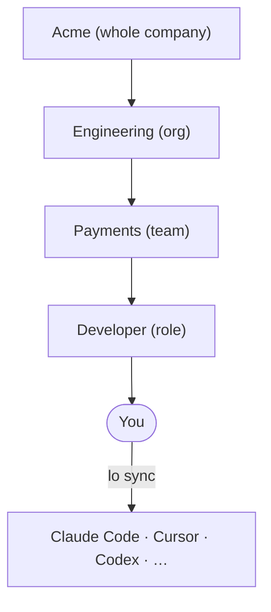

# Loadout wiki

Loadout (`lo`) gives the AI assistants you use (Claude Code, Cursor,
Codex, Pi, OpenCode, IBM Bob and others) the know-how your company and your
team have written down, and keeps it up to date.

This wiki explains Loadout in plain language, one task at a time. The
[README](../../README.md) is the complete reference; this is the friendlier
walk-through.

## Start with the page that fits you

| You are… | Read |
|---|---|
| New to all of this and just want your AI tools set up | [Getting started](Getting-Started.md), then [Using the web UI](Using-the-Web-UI.md) |
| Wondering why you got a particular skill, or didn't | [How layers work](How-Layers-Work.md) |
| Someone who wants to share a skill with your team | [Sharing skills](Sharing-Skills.md) |
| Setting Loadout up for a whole company | [Setting up your company](Setting-Up-Your-Company.md) |
| Connecting AI tools to Jira, databases and other services | [Tool connections and secrets](Tool-Connections-and-Secrets.md) |
| Looking after which updates reach you | [Updates and review](Updates-and-Review.md) |
| Stuck | [Troubleshooting and FAQ](Troubleshooting-and-FAQ.md) |

## The idea in one picture

1. **Each group keeps its skills in a Git repo**, called a *source*: the
   company, your org, your team, your role, and optionally just you.
2. **Loadout works out which groups you're in**, and only uses their
   sources.
3. **It stacks them as layers.** When two layers have something with the
   same name, the one closer to you wins, unless a layer above has locked it.
4. **It installs the result into every AI tool you use**, in each tool's own
   format, and keeps it up to date.

## All pages

- [Getting started](Getting-Started.md)
- [Key ideas](Key-Ideas.md): sources, groups, layers, company configs, AI tools
- [How layers work](How-Layers-Work.md): who wins, locks, required items, "Why?"
- [Using the web UI](Using-the-Web-UI.md): a tour of every page, including **Your layers**
- [Using the terminal](Using-the-Terminal.md): the CLI and `lo tui`
- [Sharing skills](Sharing-Skills.md): write, adopt, templates, pull requests
- [Setting up your company](Setting-Up-Your-Company.md): company configs and membership
- [Tool connections and secrets](Tool-Connections-and-Secrets.md): MCP servers
- [Updates and review](Updates-and-Review.md): sync, pinning, audits, approval
- [AI tools](AI-Tools.md): where things are installed, adding a new tool
- [Troubleshooting and FAQ](Troubleshooting-and-FAQ.md)
- [Glossary](Glossary.md)
