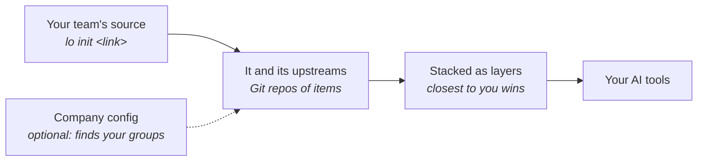

# Key ideas

Five ideas explain almost everything Loadout does.

## Items: what gets shared

An **item** is one thing an AI assistant can use:

| Kind | In the web UI | What it is |
|---|---|---|
| `skill` | Skill | Written instructions for a particular job: "write a spec our way", "what to do when paged". A folder with a `SKILL.md`. |
| `mcp` | Tool connection | Lets the assistant use another tool, such as Jira or a database (an MCP server). |
| `agent` | Subagent | A helper assistant with its own instructions. |
| `plugin` | Plugin | A Claude Code plugin. |
| `extra` | Rule or prompt | House rules, saved prompts, slash commands. |

Every item has a name, like `skill/write-spec`. Its full id adds the source it
comes from: `payments-skills:skill/write-spec`.

## Sources: where items live

A **source** is a Git repo of items, usually one per team. It has a
`LOADOUT.md` file at the top saying who it's for, and items in folders:

```text
LOADOUT.md                 # name, layer and group (who it's for)
skills/<name>/SKILL.md
mcp/<name>.md
agents/<name>.md
plugins/<name>/
extras/<type>/<name>.md
templates/<name>/        # fill-in-the-blanks skills (never installed directly)
```

Because sources are ordinary Git repos, you get history, reviews (pull
requests) and ownership for free.

A source can **build on** another one with `upstream:`. The Checkout squad's
source can name Payments' source as its upstream, and anyone who adds the
Checkout source gets Payments' items too. That's how Loadout grows: each
team connects to the teams around it, and you only ever need your own
team's link (`lo init <link>`).

One repo can also hold **several sources**: a team's items at the top and a
folder per squad, each with its own `LOADOUT.md` (the root one lists the
folders under `nested:`). Adding the repo gets you the team's items plus
those of the squads you're in.

## Groups and layers: who gets what

A **group** is a set of people: the Payments team, Engineering, product
managers, the whole company, or just you. Connecting to a team's source puts
you in its group.

A **layer** (a *layer*) is a kind of group, with a **rank**:

| Layer | Rank (default) | Example |
|---|---|---|
| `company` | 0 | acme |
| `org` | 10 | eng |
| `team` | 20 | payments-dev |
| `product` | 25 | billing |
| `squad` | 30 | checkout |
| `project` | 35 | one code repo |
| `role` | 40 | developer, product-manager |
| `user` | 50 | you |

A higher rank is more specific, closer to you. The names and ranks aren't
fixed: a source can add a layer of its own (`layers: [{ name: beta, rank:
27 }]`), a company config can define its own set, and you can re-rank any
layer or source for yourself (`lo layers set beta=27`,
`lo source set beta-skills --rank 35`). `lo layers` shows the ranks in
effect and where each came from.

You get an item when you're in its group. When two layers have an item with
the same name, the higher rank wins, unless the lower one **locked** it. That's
the whole of [How layers work](How-Layers-Work.md).

## The company config: optional, for later

A **company config** is one special source that lists every group, its
sources, and how to tell who belongs to it (GitHub or GitLab teams, your
SSO, an environment variable, or "join it yourself"). You don't need one:
team sources connected through `upstream:` work on their own. Once many
teams use Loadout, a company config lets it work out everyone's groups
automatically and set company-wide rules. `lo init <link>` accepts either
kind of link.

See [Growing across your org](Growing-Across-Your-Org.md).

## AI tools: where items end up

An **AI tool** (a *target*) is an app on your computer that Loadout installs
into: Claude Code, Cursor, Codex, Pi, OpenCode, IBM Bob, or any tool you
describe in a small file. Loadout keeps one copy of each item and links it
into each tool, in that tool's format. It only ever touches things it created;
your own skills are left alone.

See [AI tools](AI-Tools.md).

## Putting it together


